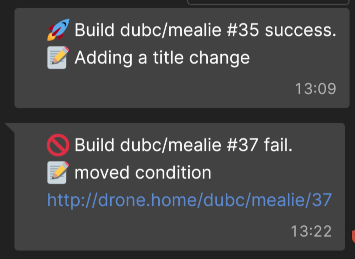

# drone-matrix-notify

The official plugin is broken so I made a new container image here [https://hub.docker.com/r/dubc/drone-matrix-notify](https://hub.docker.com/r/dubc/drone-matrix-notify). Its based off https://github.com/fabianonline/matrix.sh

Below is an example of a success and failure message.



# PROPERTIES

## homeserver

- The Matrix homeserver URL.
- `string` required

## accesstoken

- Matrix access token
- `string` required

## roomid

- Room ID to send messages (not alias, but ID, and skip the !).
- `string` required

```
  - name: Notify Element
    image: dubc/drone-matrix-notify
    settings:
      homeserver: https://matrix.domain.com
      roomid: eEReyMfMyRpGObXr:matrix.domain.com
      accesstoken:
        from_secret: matrix_drone_token
    when:
      status:
        - success
        - failure
```
